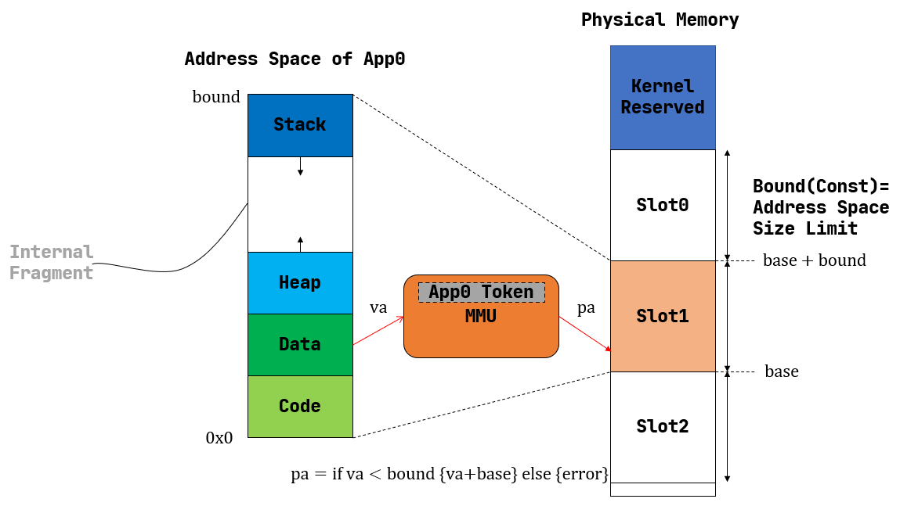
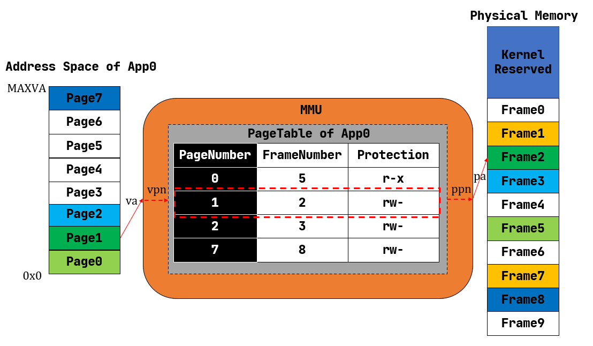
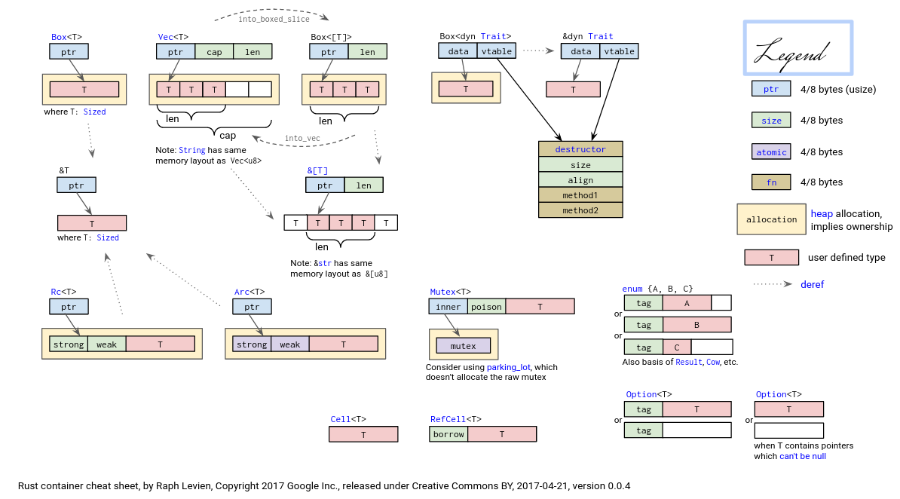

# Day 23-24

### 实验思考题

1. 好像不能编译呀（或者我不知道用什么命令；我用`rustc`去编译的）

2. 深入理解 [trap.S](https://github.com/LearningOS/rust-based-os-comp2022/blob/main/os3-ref/src/trap/trap.S) 中两个函数 `__alltraps` 和 `__restore` 的作用

   1. 刚进入 `__restore` 时，`a0` 代表了什么值「内核栈的栈指针」 ；`__restore` 的两种使用情景：「猜测，保存用户栈上下文到寄存器中，然后释放内核栈上下文，再返回用户态」

   2. L46-L51：这几行汇编代码特殊处理了哪些寄存器？这些寄存器的的值对于进入用户态有何意义？请分别解释

      ```assembly
      ld t0, 32*8(sp)
      ld t1, 33*8(sp)
      ld t2, 2*8(sp)
      csrw sstatus, t0
      csrw sepc, t1
      csrw sscratch, t2
      ```

      t0, t1, t2，sp

      猜测，用户态在栈的底部，先让t0-t2取出用户态的相关上下文，再修改sstatus,sepc,sscratch

      > [分配并使用启动栈](http://rcore-os.cn/rCore-Tutorial-Book-v3/chapter1/5support-func-call.html#jump-practice)
      >
      > 从用户特权级 陷入（ `Trap` ）到 S 特权级的时候
      >
      > - `sstatus` 的 `SPP` 字段会被修改为 CPU 当前的特权级（U/S）。
      > - `sepc` 会被修改为 Trap 处理完成后默认会执行的下一条指令的地址。
      > - `scause/stval` 分别会被修改成这次 Trap 的原因以及相关的附加信息。
      > - CPU 会跳转到 `stvec` 所设置的 Trap 处理入口地址，并将当前特权级设置为 S ，然后从Trap 处理入口地址处开始执行

   3. 为何跳过了 `x2` 和 `x4`？

      sp( `x2` ) 是栈顶指针，后续释放内核栈上下文时修改；tp( `x4` ) 是线程指针，目前我们是单线程，不会变化 

   4. `csrrw sp, sscratch, sp` 该指令之后，`sp` 和 `sscratch` 中的值分别有什么意义？

      在这一行之前 sp 指向内核栈， sscratch 指向用户栈，现在 sp 指向用户栈， sscratch 指向内核栈

      >[Trap 上下文的保存与恢复](http://rcore-os.cn/rCore-Tutorial-Book-v3/chapter2/4trap-handling.html#id8)
      >
      >`csrrw` 原型是 csrrw rd, csr, rs 可以将 CSR 当前的值读到通用寄存器 rd 中，然后将通用寄存器 rs 的值写入该 CSR 。因此这里起到的是交换 sscratch 和 sp 的效果。

   5. `__restore`：中发生状态切换在哪一条指令？为何该指令执行之后会进入用户态？
      与问题 4 同

   6. 与问题 4 相反，用户栈切换内核栈
   7. 与问题 6 相同


---

### 地址空间

- 通过动态内存分配，提高了应用程序对内存的动态使用效率
- 通过页表的虚实内存映射机制，简化了编译器对应用的地址空间设置
- 通过页表的虚实内存映射机制，加强了应用之间，应用与内核之间的内存隔离，增强了系统安全
- 通过页表的虚实内存映射机制，可以实现[空分复用](https://baike.baidu.com/item/%E7%A9%BA%E5%88%86%E5%A4%8D%E7%94%A8/5454474)


所有的应用都直接通过物理地址访问物理内存。这会带来以下问题：

- 首先，内核提供给应用的内存访问接口不够透明，也不好用。由于应用直接访问物理内存，这需要它在构建的时候就清楚所运行计算机的物理内存空间布局，还需规划自己需要被加载到哪个地址运行。为了避免冲突可能还需要应用的开发者们对此进行协商
- 其次，内核并没有对应用的访存行为进行任何保护措施，每个应用都有计算机系统中整个物理内存的读写权力。即使应用被限制在 U 特权级下运行，它还是能够造成很多麻烦：比如它可以读写其他应用的数据来窃取信息或者破坏其它应用的正常运行；甚至它还可以修改内核的代码段来替换掉原本的 `trap_handler` 函数，来挟持内核执行恶意代码。总之，这造成系统既不安全、也不稳定
- 再次，目前应用的内存使用空间在其运行前已经限定死了，内核不能灵活地给应用程序提供的运行时动态可用内存空间。比如一个应用结束后，这个应用所占的空间就被释放了，但这块空间无法动态地给其它还在运行的应用使用


基于分页机制的虚拟内存 —— 站在应用程序运行的角度看，就是存在一个从“0”地址开始的非常大的可读/可写/可执行的地址空间（Address Space），而站在操作系统的角度看，每个应用被局限在分配给它的物理内存空间中运行，无法读写其它应用和操作系统所在的内存空间。


实现地址空间的第一步就是实现分页机制，建立好虚拟内存和物理内存的页映射关系。

> - 硬件中物理内存的范围是什么？
> - 哪些物理内存空间需要建立页映射关系？
> - 如何建立页表使能分页机制？
> - 如何确保 OS 能够在分页机制使能前后的不同时间段中都能正常寻址和执行代码？
> - 页目录表（一级）的起始地址设置在哪里？
> - 二级/三级等页表的起始地址设置在哪里，需要多大空间？
> - 如何设置页目录表项/页表项的内容？
> - 如果要让每个任务有自己的地址空间，那每个任务是否要有自己的页表？
> - 代表应用程序的任务和操作系统需要有各自的页表吗？
> - 在有了页表之后，任务和操作系统之间应该如何传递数据？


三项发明：

1. 地址转换：硬件自动将处理器生成的每个地址转换为其当前内存位置
2. 按需分页（demand paging）：由硬件地址转换触发缺页中断后，由操作系统将缺失的数据页移动到主存储器中，并形成正确的地址转换映射
3. 页面置换算法：检查最无用（least useful）的页，并将其移回二级存储中，这样可以让经常访问的数据驻留在主存中


1. 首先，把 `linker.ld` 中应用程序的起始地址都改为 `0x10000` ，假定我们操作系统能够通过分页机制把不同应用的相同虚地址映射到不同的物理地址中

2. 为了能够在内核中动态分配内存，第二步需要在内核增加连续内存分配的功能「`heap_allocator`」 

3. 操作系统如果要建立页表（构建虚实地址映射关系），首先要能管理整个系统的物理内存，这就需要知道整个计算机系统的物理内存空间的范围，物理内存中哪些区域是空闲可用的，哪些区域放置内核/应用的代码和数据。

   - 操作系统内核能够以物理页帧为单位分配和回收物理内存 「`frame_allocator.rs`」

   - 操作系统内核能够在虚拟内存中以各种粒度大小来动态分配内存资源 「`heap_allocator.rs`」

4. 页表中的页表项的索引其实是虚拟地址中的虚拟页号，页表项的重要内容是物理地址的物理页帧号。
   - 灵活地在虚拟地址、物理地址、虚拟页号、物理页号之间进行各种转换 「`address.rs`」

5. 开始建立页表，这主要涉及到页表项的数据结构表示，以及多级页表的起始物理页帧位置和整个所占用的物理页帧的记录「`page_table.rs`」

6. 一旦使能分页机制，CPU 访问到的地址都是虚拟地址了，那么内核中也将基于虚地址进行虚存访问。所以在给应用添加虚拟地址空间前，内核自己也会建立一个页表，把整块物理内存通过简单的恒等映射（即虚拟地址映射到对等的物理地址）映射到内核虚拟地址空间中。后续的应用在执行前，也需要操作系统帮助它建立一个虚拟地址空间。

   - 虚拟地址空间需要有一个数据结构管理起来 「`MemorySet`」
   - 在一个虚拟地址空间中，有代码段，数据段等不同属性且不一定连续的子空间，通过一个重要的数据结构来表示和管理 「`MapArea`」
   - 围绕 `MemorySet` 等一系列的数据结构和相关操作的实现 「`memory_set.rs`」

7. 使能分页机制。有了给应用运行提供虚拟地址空间的能力，我们就可以利用 ELF 执行文件中的各种信息来灵活构建应用运行所需要的虚拟地址空间

   - `os/src/loader.rs` 中可以看到如何获取一个应用的 ELF 执行文件数据

   - `os/src/mm/memory_set` 中的 `MemorySet::from_elf` 可以看到如何通过解析 ELF 来创建一个应用地址空间
   - 操作系统需要扩展任务控制块 `TaskControlBlock` 的管理范围，使得操作系统能管理拥有独立页表和单一虚拟地址空间的应用程序的运行 [`os/src/task/task.rs` ]

8. 由于代表应用程序运行的任务和管理应用的操作系统各自有独立的页表和虚拟地址空间，所以在操作系统的设计实现上需要考虑两个挑战

   - 第一个挑战是 **页表切换** 
     - 由于系统调用、中断或异常导致的应用程序和操作系统之间的上下文切换不像以前那么简单了，因为在这些处理过程中需要切换页表 [`os/src/trap/trap.S`]
     - 还有就是需要对来自用户态和内核态的异常/中断分别进行处理 [`os/src/trap/mod.rs`]和 [跳板的实现](http://rcore-os.cn/rCore-Tutorial-Book-v3/chapter4/6multitasking-based-on-as.html#term-trampoline)

   - 第二个挑战是 **查页表以访问不同地址空间的数据**
     - 在内核地址空间中执行的内核代码常常需要读写应用的地址空间中的数据，这无法简单的通过一次访存来解决，而是需要手动查用户态应用的地址空间的页表，知道用户态应用的虚地址对应的物理地址后，转换成对应的内核态的虚地址，才能访问应用地址空间中的数据。如果访问应用地址空间中的数据跨了多个页，还需要注意处理地址的边界条件  [`os/src/syscall/fs.rs`]、[`os/src/mm/page_table.rs`]中的 [`translated_byte_buffer`]


---

#### Rust 中的动态内存分配

如果要实现动态内存分配的能力，需要操作系统需要有如下功能：

- 初始时能提供一块大内存空间作为初始的“堆”。在没有分页机制情况下，这块空间是物理内存空间，否则就是虚拟内存空间
- 提供在堆上分配和释放内存的函数接口。这样函数调用方通过分配内存函数接口得到地址连续的空闲内存块进行读写，也能通过释放内存函数接口回收内存，以备后续的内存分配请求
- 提供空闲空间管理的连续内存分配算法。相关算法能动态地维护一系列空闲和已分配的内存块，从而有效地管理空闲块
- （可选）提供建立在堆上的数据结构和操作。有了上述基本的内存分配与释放函数接口，就可以实现类似动态数组，动态字典等空间灵活可变的堆数据结构，提高编程的灵活性


[静态与动态内存分配](http://rcore-os.cn/rCore-Tutorial-Book-v3/chapter4/1rust-dynamic-allocation.html#id2)

- 静态分配

  若在某一时间点观察一个应用的地址空间，可以看到若干个内存块，每一块都对应于一个生命周期尚未结束的变量。

  这个变量可能是一个局部变量，它来自于正在执行的当前函数调用栈上，即它是被分配在栈上；

  这个变量也可能是一个全局变量，它一般被分配在数据段中。

  它们有一个共同点：在编译器编译程序时已经知道这些变量所占的字节大小，于是给它们分配一块固定的内存将它们存储其中，这样变量在栈帧/数据段中的位置就被固定了下来。

  这些变量是被 静态分配 (Static Allocation) 的，这一过程来源于我们在程序中对变量的声明，在编译期由编译器完成。

  如果应用仅使用静态分配，它可以应付一部分的需求，但是对于其它情况，如某些数据结构需求的内存大小取决于程序的实际运行情况，就不够灵活了。

- 动态分配

  应用另外放置了一个大小可以随着应用的运行动态增减的内存空间 – 堆（Heap）。

  同时，应用还要能够将这个堆管理起来，即支持在运行的时候从里面分配一块空间来存放变量，而在变量的生命周期结束之后，这块空间需要被回收以待后面的使用。

  如果堆的大小固定，那么这其实就是一个连续内存分配问题

  一般情况下，应用所依赖的基础系统库（如 Linux 中的 glibc 库等）会直接通过系统调用（如类 Unix 内核提供的 sbrk 系统调用）来向内核请求增加/缩减应用地址空间内堆的大小，之后应用就可以基于基础系统库提供的内存分配/释放函数来获取和释放内存了。

  应用进行多次不同大小的内存分配和释放操作后，会产生内存空间的浪费，即存在无法被应用使用的空闲内存碎片。

  除了可以灵活利用内存之外，动态分配还允许我们以尽可能小的代价灵活调整变量的生命周期。

  一个局部变量被静态分配在它所在函数的栈帧中，一旦函数返回，这个局部变量的生命周期也就结束了；

  而静态分配在数据段中的全局变量则是在应用的整个运行期间均存在。

  动态分配允许我们构造另一种并不一直存在也不绑定于函数调用的变量生命周期：

  以 C 语言为例，可以说自 `malloc` 拿到指向一个变量的指针到 `free` 将它回收之前的这段时间，这个变量在堆上存在。

  由于需要跨越函数调用，我们需要作为堆上数据代表的变量在函数间以参数或返回值的形式进行传递，而这些变量一般都很小（如一个指针），其拷贝开销可以忽略。

  而动态内存分配的缺点在于：它背后运行着连续内存分配算法，相比静态分配会带来一些额外的开销。如果动态分配非常频繁，可能会产生很多无法使用的内存碎片，甚至可能会成为应用的性能瓶颈。


> **内存碎片**
>
> 内存碎片是指无法被分配和使用的空闲内存空间。可进一步细分为内碎片和外碎片：
>
> - 内碎片：已被分配出去（属于某个在运行的应用）内存区域，占有这些区域的应用并不使用这块区域，操作系统也无法利用这块区域。
> - 外碎片：还没被分配出去（不属于任何在运行的应用）内存空闲区域，由于太小而无法分配给提出申请内存空间的应用。
>
> 为何应用开发者在编程中“看不到”内存碎片？
> 这是因为动态内存管理有更底层的系统标准库来完成的，它能看到并进行管理。而应用开发者只需调用系统标准库提供的内存申请/释放函数接口即可。


> 我们在程序中能够 **直接** 看到的变量都是被静态分配在栈或者全局数据段上的，它们大小在编译期已知。
> 比如我们可以把固定大小的指针放到栈（局部变量）或数据段（全局变量）上，然后通过指针来指向运行时才确定的堆空间上的数据，并进行访问。
> 这样就可以通过确定大小的指针来实现对编译时大小不确定的堆数据的访问。


[Rust 中的堆数据结构](http://rcore-os.cn/rCore-Tutorial-Book-v3/chapter4/1rust-dynamic-allocation.html#rust-heap-data-structures)


[在内核中支持动态内存分配](http://rcore-os.cn/rCore-Tutorial-Book-v3/chapter4/1rust-dynamic-allocation.html#term-raii)

- 如果要在操作系统内核中支持动态内存分配，则需要实现：初始化堆、分配/释放内存块的函数接口、连续内存分配算法
- Rust语言在 `alloc` crate 中设定了一套简洁规范的接口，只要实现了这套接口，内核就可以很方便地支持动态内存分配了

- 与堆相关的智能指针或容器都可以在 Rust 自带的 `alloc` crate 中找到。当我们使用 Rust 标准库 `std` 的时候可以不用关心这个 crate ，因为标准库内已经已经实现了一套堆管理算法，并将 `alloc` 的内容包含在 `std` 名字空间之下让开发者可以直接使用。然而操作系统内核运行在禁用标准库（即 `no_std` ）的裸机平台上，核心库 `core` 也并没有动态内存分配的功能，这个时候就要考虑利用 `alloc` 库定义的接口来实现基本的动态内存分配器。

- `alloc` 库需要我们提供给它一个 `全局的动态内存分配器` ，它会利用该分配器来管理堆空间，从而使得与堆相关的智能指针或容器数据结构可以正常工作。具体而言，我们的动态内存分配器需要实现它提供的 `GlobalAlloc` Trait，这个 Trait 有两个必须实现的抽象接口：

  ```rust
  // alloc::alloc::GlobalAlloc
  
  pub unsafe fn alloc(&self, layout: Layout) -> *mut u8;
  pub unsafe fn dealloc(&self, ptr: *mut u8, layout: Layout);
  ```

  它们类似 C 语言中的 `malloc/free` ，分别代表堆空间的分配和回收，也同样使用一个裸指针（也就是地址）作为分配的返回值和回收的参数。两个接口中都有一个 `alloc::alloc::Layout` 类型的参数， 它指出了分配的需求，分为两部分，分别是所需空间的大小 `size` ，以及返回地址的对齐要求 `align` 。这个对齐要求必须是一个 2 的幂次，单位为字节数，限制返回的地址必须是 `align` 的倍数。

  > **为何 C 语言 malloc 的时候不需要提供对齐需求？**
  >
  > 在 C 语言中，所有对齐要求的最大值是一个平台相关的常数（比如 8 bytes），消耗少量内存即可使得每一次分配都符合这个最大的对齐要求。因此也就不需要区分不同分配的对齐要求了。而在 Rust 中，某些分配的对齐要求的值可能很大，就只能采用更加复杂的方法。

  然后只需将我们的动态内存分配器类型实例化为一个全局变量，并使用 `#[global_allocator]` 语义项标记即可 —— 分配器实现复杂，使用库 `buddy_system_allocator` [`os/src/mm/heap_allocator.rs`]


> buddy_system_allocator [`os/Cargo.toml`]
>
> extern crate alloc [`os/src/main.rs`]
>
> HEAP_ALLOCATOR, HEAP_SPACE, init_heap(), handle_alloc_error() [`os/src/mm/heap_allocator.rs`]


---

#### 地址空间

> CPU 访问数据和指令的内存地址是虚地址，通过硬件机制（比如 MMU +页表查询）进行地址转换，找到对应的物理地址

内存管理抽象： **地址空间**

内核中建立虚实地址空间的映射机制，给应用程序提供一个基于地址空间的安全虚拟内存环境，让应用程序简单灵活地使用内存

> [计算机硬件的支持： `MMU` 和 `TLB` 等硬件机制](https://www.cnblogs.com/luoahong/p/11385395.html#circle=on)
>
> MMU 与 TLB
>
> - MMU是Memory Management Unit的缩写，中文名是内存管理单元，它是中央处理器（CPU）中用来管理虚拟存储器、物理存储器的控制线路，同时也负责虚拟地址映射为物理地址，以及提供硬件机制的内存访问授权，多用户多进程操作系统。
> - TLB(Translation Lookaside Buffer)传输后备缓冲器，是一个内存管理单元用于改进虚拟地址到物理地址转换速度的缓存。TLB是一个小的，虚拟寻址的缓存，其中每一行都保存着一个由单个PTE组成的块。如果没有TLB，则每次取数据都需要两次访问内存，即查页表获得物理地址和取数据。


[虚拟地址与地址空间](http://rcore-os.cn/rCore-Tutorial-Book-v3/chapter4/2address-space.html#id3)

- 应用能够直接看到并访问的内存就只有操作系统提供的地址空间，且它的任何一次访存使用的地址都是虚拟地址，无论取指令来执行还是读写栈、堆或是全局数据段都是如此。事实上，特权级机制被拓展，使得应用不再具有直接访问物理内存的能力。应用所处的执行环境在安全方面被进一步强化，形成了用户态特权级和地址空间的二维安全措施。

- 由于每个应用独占一个地址空间，里面只含有自己的各个段，于是它可以随意规划属于它自己的各个段的分布而无需考虑和其他应用冲突；同时鉴于应用只能通过虚拟地址读写它自己的地址空间，它完全无法窃取或者破坏其他应用的数据，毕竟那些段在其他应用的地址空间内，这是它没有能力去访问的。这是地址空间抽象和具体硬件机制对应用程序执行的安全性和稳定性的一种保障。


[增加硬件加速虚实地址转换](http://rcore-os.cn/rCore-Tutorial-Book-v3/chapter4/2address-space.html#id6)

- 当 CPU 取指令或者执行一条访存指令的时候，它都是基于虚拟地址访问属于当前正在运行的应用的地址空间。此时，CPU 中的 **内存管理单元** (MMU, Memory Management Unit) 自动将这个虚拟地址进行 **地址转换** (Address Translation) 变为一个物理地址，即这个应用的数据/指令的物理内存位置。也就是说，在 MMU 的帮助下，应用对自己虚拟地址空间的读写才能被实际转化为对于物理内存的访问
- 每个应用的地址空间都存在一个从虚拟地址到物理地址的映射关系。对于不同的应用来说，该映射可能是不同的，即 **MMU 可能会将来自不同两个应用地址空间的相同虚拟地址转换成不同的物理地址**。要做到这一点，就需要硬件提供一些寄存器，软件可以对它进行设置来控制 MMU 按照哪个应用的地址映射关系进行地址转换。于是，将应用的代码/数据放到物理内存并进行管理，建立好应用的地址映射关系，**在任务切换时控制 MMU 选用应用的地址映射关系，则是作为软件部分的内核需要完成的重要工作**

> 内核对于 CPU 资源的抽象——时分复用
>
> - 内核为应用制造了一种每个应用独占整个 CPU 的幻象，而隐藏了多个应用分时共享 CPU 的实质
>
> 地址空间
>
> - 应用只需、也只能看到它独占整个地址空间的幻象，而藏在背后的实质仍然是多个应用共享物理内存，它们的数据分别存放在内存的不同位置


实现策略 —— [分段内存管理](http://rcore-os.cn/rCore-Tutorial-Book-v3/chapter4/2address-space.html#id7)

1. simple-base-bound —— 地址空间大小固定



- 每个应用的地址空间大小限制为一个固定的常数 `bound` ，也即每个应用的可用虚拟地址区间均为 [0,bound) 。随后，就可以以这个大小为单位，将物理内存除了内核预留空间之外的部分划分为若干个大小相同的 **插槽** (Slot) ，每个应用的所有数据都被内核放置在其中一个插槽中，对应于物理内存上的一段连续物理地址区间，假设其起始物理地址为 base ，则由于二者大小相同，这个区间实际为 [base,base+bound) 。因此地址转换很容易完成，只需检查一下虚拟地址不超过地址空间的大小限制（此时需要借助特权级机制通过异常来进行处理），然后做一个线性映射，将虚拟地址加上 base 就得到了数据实际所在的物理地址。

- 可以看出，这种实现极其简单：MMU 只需要 base,bound 两个寄存器，在地址转换进行比较或加法运算即可；而内核只需要在任务切换时完成切换 base 寄存器。在对一个应用的内存管理方面，只需考虑一组插槽的占用状态，可以用一个 **位图** (Bitmap) 来表示，随着应用的新增和退出对应置位或清空。

- 然而，它的问题在于：可能浪费的内存资源过多。注意到应用地址空间预留了一部分，它是用来让栈得以向低地址增长，同时允许堆往高地址增长（支持应用运行时进行动态内存分配）。每个应用的情况都不同，内核只能按照在它能力范围之内的消耗内存最多的应用的情况来统一指定地址空间的大小，而其他内存需求较低的应用根本无法充分利用内核给他们分配的这部分空间。但这部分空间又是一个完整的插槽的一部分，也不能再交给其他应用使用。这种在已分配/使用的地址空间内部无法被充分利用的空间就是 **内碎片** (Internal Fragment) ，它限制了系统同时共存的应用数目。如果应用的需求足够多样化，那么内核无论如何设置应用地址空间的大小限制也不能得到满意的结果。这就是固定参数的弊端：虽然实现简单，但不够灵活。


2. 改进 —— 另一种分段管理的策略


- 内核开始以更细的粒度，也就是应用地址空间中的一个逻辑段作为单位来安排应用的数据在物理内存中的布局。对于每个段来说，从它在某个应用地址空间中的虚拟地址到它被实际存放在内存中的物理地址中间都要经过一个不同的线性映射，于是 MMU 需要用一对不同的 base/bound 进行区分。这里由于每个段的大小都是不同的，我们也不再能仅仅使用一个 bound 进行简化。当任务切换的时候，这些对寄存器也需要被切换

  > 暂时忽略细节，这里只关注分段管理是否解决了内碎片带来的内存浪费问题
  >
  > 应用在以虚拟地址为索引访问地址空间的时候，它如何知道该地址属于哪个段，从而硬件可以使用正确的一对 base/bound 寄存器进行合法性检查和完成实际的地址转换

- 每个段都只会在内存中占据一块与它实际所用到的大小相等的空间。堆的情况可能比较特殊，它的大小可能会在运行时增长，但是那需要应用通过系统调用向内核请求。也就是说这是一种按需分配，而不再是内核在开始时就给每个应用分配一大块很可能用不完的内存。由此，不再有内碎片了

- 尽管内碎片被消除了，但内存浪费问题并没有完全解决。这是因为每个段的大小都是不同的（它们可能来自不同的应用，功能也不同），内核就需要使用更加通用、也更加复杂的连续内存分配算法来进行内存管理，而不能像之前的插槽那样以一个比特为单位。顾名思义，连续内存分配算法就是每次需要分配一块连续内存来存放一个段的数据。随着一段时间的分配和回收，物理内存还剩下一些相互不连续的较小的可用连续块，其中有一些只是两个已分配内存块之间的很小的间隙，它们自己可能由于空间较小，已经无法被用于分配，这就是 **外碎片** (External Fragment)

- 如果这时再想分配一个比较大的块，就需要将这些不连续的外碎片“拼起来”，形成一个大的连续块。然而这是一件开销很大的事情，涉及到极大的内存读写开销。具体而言，这需要移动和调整一些已分配内存块在物理内存上的位置，才能让那些小的外碎片能够合在一起，形成一个大的空闲块。如果连续内存分配算法选取得当，可以尽可能减少这种操作

  > 操作系统课上所讲到的那些算法，包括 first-fit/worst-fit/best-fit 或是 buddy system，其具体表现取决于实际的应用需求，各有优劣


实现策略 —— [分页内存管理](http://rcore-os.cn/rCore-Tutorial-Book-v3/chapter4/2address-space.html#id8)

> 分段内存管理带来的 外碎片 和 连续内存分配算法比较复杂 的问题 如何解决？

> 段的大小不一是外碎片产生的根本原因。之前把应用的整个地址空间连续放置在物理内存中，在每个应用的地址空间大小均相同的情况下，只需利用类似位图的数据结构维护一组插槽的占用状态，从逻辑上分配和回收都是以一个固定的比特为单位，自然也就不会存在外碎片了。但是这样粒度过大，不够灵活，又在地址空间内部产生了内碎片。

结合前二者的优点

- 需要内核始终以一个同样大小的单位来在物理内存上放置应用地址空间中的数据，这样内核就可以使用简单的插槽式内存管理，使得内存分配算法比较简单且不会产生外碎片
- 同时，这个单位的大小要足够小，从而其内部没有被用到的内碎片的大小也足够小，尽可能提高内存利用率（仍然有内碎片）



- 内核以页为单位进行物理内存管理
- 每个应用的地址空间可以被分成若干个（虚拟） **页面** (Page) ，而可用的物理内存也同样可以被分成若干个（物理） **页帧** (Frame) ，虚拟页面和物理页帧的大小相同
- 每个虚拟页面中的数据实际上都存储在某个物理页帧上
- 相比分段内存管理，分页内存管理的粒度更小且大小固定，应用地址空间中的每个逻辑段都由多个虚拟页面组成
- 每个虚拟页面在地址转换的过程中都使用与运行的应用绑定的不同的线性映射，而不像分段内存管理那样每个逻辑段都使用一个相同的线性映射
- 为了方便实现虚拟页面到物理页帧的地址转换，我们给每个虚拟页面和物理页帧一个编号，分别称为 **虚拟页号** (VPN, Virtual Page Number) 和 **物理页号** (PPN, Physical Page Number) 
- 每个应用都有一个表示地址映射关系的 **页表** (Page Table) ，里面记录了该应用地址空间中的每个虚拟页面映射到物理内存中的哪个物理页帧，即数据实际被内核放在哪里。我们可以用页号来代表二者，因此如果将页表看成一个键值对，其键的类型为虚拟页号，值的类型则为物理页号
- 当 MMU 进行地址转换的时候，虚拟地址会分为两部分（虚拟页号，页内偏移），MMU首先找到虚拟地址所在虚拟页面的页号，然后查当前应用的页表，根据虚拟页号找到物理页号；最后按照虚拟地址的页内偏移，给物理页号对应的物理页帧的起始地址加上一个偏移量，这就得到了实际访问的物理地址
- 在页表中，还针对虚拟页号设置了一组保护位，它限制了应用对转换得到的物理地址对应的内存的使用方式。最典型的如 `rwx` ， `r` 表示当前应用可以读该内存； `w` 表示当前应用可以写该内存； `x` 则表示当前应用可以从该内存取指令用来执行。一旦违反了这种限制则会触发异常，并被内核捕获到。
- 当一个应用的地址空间比较大的时候，页表中的项数会很多（事实上每个虚拟页面都应该对应页表中的一项，上图中我们已经省略掉了那些未被使用的虚拟页面），导致它的容量极速膨胀，已经不再是像之前那样数个寄存器便可存下来的了，CPU 内也没有足够的硬件资源能够将它存下来。因此它只能作为一种被内核管理的数据结构放在内存中，但是 CPU 也会直接访问它来查页表，这也就需要内核和硬件之间关于页表的内存布局达成一致
- 由于分页内存管理既简单又灵活，它逐渐成为了主流的内存管理机制，RISC-V 架构也使用了这种机制


> **补充**
>
> [内存管理：分页，分段，段页结合](https://blog.csdn.net/zouliping123/article/details/8869455)
>
> [操作系统：内存管理之分页和分段](https://raoxuntian.github.io/2020/08/09/os-paging-and-segmentation/)
>
> [深入理解操作系统之——分页式存储管理](https://zhuanlan.zhihu.com/p/37549063)
>
> 1.分页管理
> 　　分页存储管理是将一个进程的逻辑地址空间分成若干个大小相等的片，称为页面或页，并为各页加以编号，从0开始，如第0页、第1页等。相应地，也把内存空间分成与页面相同大小的若干个存储块，称为(物理)块或页框(frame)，也同样为它们加以编号，如0#块、1#块等等。在为进程分配内存时，以块为单位将进程中的若干个页分别装入到多个可以不相邻接的物理块中。由于进程的最后一页经常装不满一块而形成了不可利用的碎片，称之为“页内碎片”。
> 	优缺点：没有外部碎片，内存利用率高。但各页中内容没有关联，不利于编程和共享。
>
> 2.分段管理
> 　　把程序按内容或过程（函数）关系分成段，每段有自己的名字。一个用户作业或进程所包含的段对应一个二维线形虚拟空间，也就是一个二维虚拟存储器。段式管理程序以段为单位分配内存，然后通过地址影射机构把段式虚拟地址转换为实际内存物理地址。
> 　　程序通过分段(segmentation)划分为多个模块，如代码段、数据段、共享段。内存每段的大小都匹配程序段，不会产生内部碎片。
> 	优缺点： 可以针对不同类型的段采取不同的保护。 可以按段为单位来进行共享，包括通过动态链接进行代码共享。 不会产生内部碎片，但会产生外部碎片，内存利用率比分页低。
>
> 3.段页式管理
> 　　一个进程中所包含的具有独立逻辑功能的程序或数据仍被划分为段，并有各自的段号s。这反映相继承了段式管理的特征。其次，对于段s中的程序或数据，则按照一定的大小将其划分为不同的页。和页式系统一样，最后不足一页的部分仍占一页。这反映了段页式管理中的页式特征。从而，段页式管理时的进程的虚拟地址空间中的虚拟地址由三部分组成：即段号s，页号P和页内相对地址d。虚拟空间的最小单位是页而不是段，从而内存可用区也就被划分成为着干个大小相等的页面，且每段所拥有的程序和数据在内存中可以分开存放。分段的大小也不再受内存可用区的限制。
> 　　为了实现段页式管理，系统必须为每个作业或进程建立一张段表以管理内存分配与释放、缺段处理、存储保护相地址变换等。另外，由于一个段又被划分成了若干页，每个段又必须建立一张页表以把段中的虚页变换成内存中的实际页面。显然，与页式管理时相同，页表中也要有相应的实现缺页中断处理和页面保护等功能的表项。另外，由于在段页式管理中，页表不再是属于进程而是属于某个段，因此，段表中应有专项指出该段所对应页表的页表始址和页表长度。
> 	优缺点：既有具有独立逻辑功能的段，又以大小相同的页为内存分配单位进而不会产生外部碎片。但仍会有内部碎片。


---

#### 采用分页管理 SV39 多级页表的硬件机制（RISC-V 64 架构提供）

- 虚拟地址与物理地址的访问属性（可读，可写，可执行等）
- 组成结构（页号，帧号，偏移量等）
- 访问的空间范围
- 硬件实现地址转换的多级页表访问过程等
- 用Rust语言来设计有类型的页表项


[虚拟地址和物理地址](http://rcore-os.cn/rCore-Tutorial-Book-v3/chapter4/3sv39-implementation-1.html#id2)

- [内存控制相关的CSR寄存器](http://rcore-os.cn/rCore-Tutorial-Book-v3/chapter4/3sv39-implementation-1.html#csr)

- `satp`字段分布以及含义

- 地址格式与组成：单个页面的大小 -> 页内偏移，低位位数；高位虚拟页号 VPN /物理页号 PPN

  > 为什么虚拟页号少于物理页号？

  > PhysAddr，PhysAddr，PhysPageNum，VirtPageNum [os/src/mm/address.rs]

- 对于不对齐的情况，物理地址不能通过 `From/Into` 转换为物理页号，而是需要通过它自己的 `floor` 或 `ceil` 方法来进行下取整或上取整的转换 [os/src/mm/address.rs]


[页表项的数据结构抽象与类型定义](http://rcore-os.cn/rCore-Tutorial-Book-v3/chapter4/3sv39-implementation-1.html#id5)

- 页表项 (PTE, Page Table Entry) ：物理页号和全部的标志位
- 最低的 8 位标志位及其含义
- `bitflags` 先来实现页表项中的标志位 `PTEFlags` [os/src/mm/page_table.rs]
- 实现页表项 `PageTableEntry` [os/src/mm/page_table.rs]


[多级页表](http://rcore-os.cn/rCore-Tutorial-Book-v3/chapter4/3sv39-implementation-1.html#id6)

- 页表的一种最简单的实现是线性表，也就是按照地址从低到高、输入的虚拟页号从 0 开始递增的顺序依次在内存中放置每个虚拟页号对应的页表项；

  > 线性表的问题在于：它保存了所有虚拟页号对应的页表项，但是高达 512GiB 的地址空间中真正会被应用使用到的只是其中极小的一个子集（本教程中的应用内存使用量约在数十~数百 KiB 量级），也就导致有意义并能在页表中查到实际的物理页号的虚拟页号在 227 中也只是很小的一部分。由此线性表的绝大部分空间其实都是被浪费掉的

- **按需分配**：有多少合法的虚拟页号，我们就维护一个多大的映射，并为此使用多大的内存用来保存映射

  > SV39 分页机制等价于一颗字典树

  **多级页表** (Multi-Level Page-Table) 

  > 由于 SV39 中虚拟页号被分为三级 **页索引** (Page Index) ，因此这是一种三级页表。
  >
  > 非叶节点（页目录表，非末级页表）的表项标志位含义和叶节点（页表，末级页表）相比有一些不同

  > - 当 `V` 为 0 的时候，代表当前指针是一个空指针，无法走向下一级节点，即该页表项对应的虚拟地址范围是无效的；
  > - 只有当 `V` 为1 且 `R/W/X` 均为 0 时，表示是一个合法的页目录表项，其包含的指针会指向下一级的页表；
  > - 注意: 当 `V` 为1 且 `R/W/X` 不全为 0 时，表示是一个合法的页表项，其包含了虚地址对应的物理页号。

  > 拓展
  >
  > **大页**：RISC-V 64处理器在地址转换过程中，只要表项中的 `V` 为 1 且 `R/W/X` 不全为 0 就会直接从当前的页表项中取出物理页号，再接上页内偏移，就完成最终的地址转换。
  >
  > 注意这个过程可以发生在多级页表的任意一级。（比如后面介绍 **处理 TLB MISS**）如果这一过程并没有发生在多级页表的最深层，那么在地址转换的时候，物理页号对应的物理页帧的起始物理地址的位数与页内偏移的位数都 和 按缺省页处理时 的情况不同了。我们需要按 **大页** 的地址转换方式来处理。
  >
  > 在 SV39 中，如果使用了一级页索引就停下来，则它可以涵盖虚拟页号的高 9 位为某一固定值的所有虚拟地址，对应于一个 1GiB 的大页；如果使用了二级页索引就停下来，则它可以涵盖虚拟页号的高 18 位为某一固定值的所有虚拟地址，对应于一个 2MiB 的大页。以同样的视角，如果使用了所有三级页索引才停下来，它可以涵盖虚拟页号的高 27 为某一个固定值的所有虚拟地址，自然也就对应于一个大小为 4KiB 的虚拟页面。
  >
  > 使用大页的优点在于，当地址空间的大块连续区域的访问权限均相同的时候，可以直接映射一个大页，从时间上避免了大量页表项的读写开销，从空间上降低了所需节点的数目。但是，从内存分配算法的角度，这需要内核支持从物理内存上分配三种不同大小的连续区域（ 4KiB 或是另外两种大页），便不能使用更为简单的插槽式管理。
  >
  > **分析 SV39 多级页表的内存占用**
  >
  > 我们知道，多级页表的总内存消耗取决于节点的数目，每个节点则需要一个大小为 4KiB 物理页帧存放。考虑一个地址空间，除了根节点的一个物理页帧之外，地址空间中的每个实际用到的大小为 T 字节的 *连续* 区间会让多级页表额外消耗不超过 4KiB×(T/2MiB+T/1GiB) 的内存。这是因为，括号中的两项分别对应为了映射这段连续区间所需要新分配的最深层和次深层节点的数目，前者（对应第二级页表）每连续映射 2MiB 才会新分配一个 4Kib 的第一级页表，而后者（对应根页表，第三级页表）每连续映射 1GiB 才会新分配一个 4Kib 的第二级页表。由于后者远小于前者，可以将后者忽略，最后得到的结果近似于 T/512 。而一般情况下我们对于地址空间的使用方法都是在其中放置少数几个连续的逻辑段，因此当一个地址空间实际使用的区域大小总和为 S 字节的时候，我们可以认为为此多级页表消耗的内存在 S/512 左右。相比线性表固定消耗 1GiB 的内存，这已经相当可以接受了。
  >
  > 然而，从理论上来说，不妨设某个应用地址空间中的实际用到的总空间大小为 S 字节，则对于这个应用的 SV39 多级页表所需的内存量，有两个更加严格的上限：
  >
  > - 每映射一个 4KiB 的虚拟页面，需要初始就有一个页表根节点，因为还需其它两级页表节点，故最多还需要新分配两个物理页帧来保存新的节点，因此消耗内存不超过 4KiB×(1+2\*S/4KiB)=4KiB+2\*S ；
  > - 考虑已经映射了很多虚拟页面，使得根节点的 512 个孩子节点都已经被分配的情况，此时最坏的情况是每次映射都需要分配一个不同的最深层节点，加上根节点的所有孩子节点并不一定都被分配，从这个角度来讲消耗内存不超过 4KiB×(1+512+S/4KiB)=4KiB+2MiB+S 。
  >
  > 虽然这两个上限值都可以通过刻意构造一种地址空间的使用来达到，但是它们看起来很不合理，因为它们均大于 S ，也就是元数据比数据还大。其实，真实环境中一般不会有如此极端的使用方式，一般情况下我们知道多级页表消耗内存为 S/512 左右就行了。


- [SV39 地址转换过程](http://rcore-os.cn/rCore-Tutorial-Book-v3/chapter4/3sv39-implementation-1.html#id7)


- 每个页表都用 9 位索引的，因此有 29=512 个页表项，而每个页表项都是 8 字节，因此每个页表大小都为 512×8=4KiB 。正好是一个物理页的大小。我们可以把一个页表放到一个物理页中，并用一个物理页号来描述它。事实上，三级页表的每个页表项中的物理页号可描述一个二级页表；二级页表的每个页表项中的物理页号可描述一个一级页表；一级页表中的页表项内容则和我们刚才提到的页表项一样，其内容包含物理页号，即描述一个要映射到的物理页

- 具体来说，假设我们有虚拟地址 (VPN2,VPN1,VPN0,offset) ：

  - 我们首先会记录装载「当前所用的三级页表的物理页」的页号到 satp 寄存器中；
  - 把 VPN2 作为偏移在第三级页表的物理页中找到第二级页表的物理页号；
  - 把 VPN1 作为偏移在第二级页表的物理页中找到第一级页表的物理页号；
  - 把 VPN0 作为偏移在第一级页表的物理页中找到要访问位置的物理页号；
  - 物理页号对应的物理页基址（即物理页号左移12位）加上 offset 就是虚拟地址对应的物理地址。

- 若页表项满足 R,W,X 都为 0，表明这个页表项指向下一级页表。在这里三级和二级页表项的 R,W,X 为 0 应该成立，因为它们指向了下一级页表

- [快表（TLB）](http://rcore-os.cn/rCore-Tutorial-Book-v3/chapter4/3sv39-implementation-1.html#tlb)

  - 虚拟页号到物理页号的映射的页表缓存。当我们要进行一个地址转换时，会有很大可能对应的地址映射在近期已被完成过，所以我们可以先到 TLB 缓存里面去查一下，如果有的话我们就可以直接完成映射，而不用访问那么多次内存了

  - 在一个多任务系统中，可能同时存在多个任务处于运行/就绪状态，它们各自的多级页表在内存中共存，那么 MMU 应该如何知道当前做地址转换的时候要查哪一个页表呢？

    - 回到 [satp CSR 的布局](http://rcore-os.cn/rCore-Tutorial-Book-v3/chapter4/3sv39-implementation-1.html#satp-layout) ，其中的 PPN 字段指的就是多级页表根节点所在的物理页号。因此，每个应用的地址空间就可以用包含了它多级页表根节点（第三级页表）所在物理页号的 `satp` CSR 代表。在我们切换任务的时候， `satp` 也必须被同时切换。

    - 但如果修改了 satp 寄存器，说明内核切换到了一个与先前映射方式完全不同的页表。此时快表里面存储的映射已经失效了，这种情况下内核要在修改 satp 的指令后面马上使用 sfence.vma 指令刷新清空整个 TLB。

    - 同样，我们手动修改一个页表项之后，也修改了映射，但 TLB 并不会自动刷新清空，我们也需要使用 sfence.vma 指令刷新整个 TLB。注：可以在 sfence.vma 指令后面加上一个虚拟地址，这样 sfence.vma 只会刷新TLB中关于这个虚拟地址的单个映射项。

>  补充：
>
> [RISC-V 特权指令结构](https://www.eggvs.com/article/10844.html)
>
> - HART 硬件线程（hardware thread）
>
> [处理器中的存储系统（一）：RISC-V的FENCE、FENCE.I指令](https://zhuanlan.zhihu.com/p/139797515)

> 多进程间频繁切换对TLB有什么影响？现代的处理器是如何面对这个问题的？
>
> - 在现代处理器中,软件使用虚拟地址访问内存,而处理器的MMU单元负责把虚拟地址转换成物理地址,为了完成这个映射过程,软件和硬件共同来维护一个多级映射的页表。当处理器发现页表中无法映射到对应的物理地址时,会触发一个缺页异常,挂起出错的进程,操作系统软件需要处理这个缺页异常。我们之前有提到过二级页表的查询过程,为了完成虚拟地址到物理地址的转换,查询页表需要两次访问内存,即一级页表和二级页表都是存放在内存中的。 
>
> - TLB( Translation Look- aside buffer)专门用于缓存内存中的页表项,一般在MMU单元内部。TLB是一个很小的 cache,TLB表项( TLB entry)数量比较少,每个TLB表项包含一个页面的相关信息,例如有效位、虚拟页号、修改位、物理页帧号等。当处理器要访问一个虚拟地址时,首先会在TLB中查询。如果TLB表项中没有相应的表项,称为TLB Miss,那么就需要访问页表来计算出相应的物理地址。如果TLB表项中有相应的表项,那么直接从TLB表项中获取物理地址,称为TLB命中。
>   TLB内部存放的基本单位是TLB表项,TLB容量越大,所能存放的TLB表项就越多,TLB命中率就越高,但是TLB的容量是有限的。目前 Linux内核默认采用4KB大小的小页面,如果一个程序使用512个小页面,即2MB大小,那么至少需要512个TLB表项才能保证不会出现 TLB Miss的情况。但是如果使用2MB大小的大页,那么只需要一个TLB表项就可以保证不会出现 TLB Miss的情况。对于消耗内存以GB为单位的大型应用程序,还可以使用以1GB为单位的大页,从而减少 TLB Miss的情况。

---

#### Rust

**复习**

> **rust指针**
>
> - 裸指针 `*const T/*mut T` 基本等价于 C/C++ 里面的普通指针 `T*` ，它自身的内容仅仅是一个地址。它最为灵活，但是也最不安全。编译器只能对它进行最基本的可变性检查（只读的数据不能写），通过裸指针解引用来访问数据的行为是 unsafe 行为，需要被包裹在 unsafe 块中
> - 引用 `&T/&mut T` 实质上只是一个地址范围，但是 Rust 编译器会在编译的时候进行比较严格的 **借用检查** (Borrow Check) ，来确保在编译期就解决掉很多内存不安全问题 [ [Rust 所有权模型](http://rcore-os.cn/rCore-Tutorial-Book-v3/chapter2/3batch-system.html#rust-ownership-model) ]
> - 智能指针不仅包含它指向区域的地址范围，还含有一些额外的信息，因此这个类型的大小大于裸指针的大小，属于一种“胖”指针。从用途上看，它不仅可以作为一个媒介来访问它指向的数据，还能在这个过程中起到管理和控制的功能


> [Rust 中的堆数据结构](http://rcore-os.cn/rCore-Tutorial-Book-v3/chapter4/1rust-dynamic-allocation.html#rust-heap-data-structures)
>
> **智能指针** (Smart Pointer) 
>
> 在 Rust 中，与动态内存分配相关的智能指针主要有如下这些：
>
> - `Box<T>` 在创建时会在堆上分配一个类型为 `T` 的变量，它自身也只保存在堆上的那个变量的位置。而和裸指针或引用不同的是，当 `Box<T>` 被回收的时候，它指向的那个变量（位于堆上）也会被回收。`Box<T>` 可以对标 C++ 的 `std::unique_ptr` 。
>
> - `Rc<T>` 是一个单线程上使用的引用计数类型，它提供了多所有权支持，即可同时存在多个智能指针指向同一个堆上变量的 `Rc<T>` ，它们都可以拿到指向变量的不可变引用来访问这同一个变量。而它同时也是一个引用计数，事实上在堆上的另一个位置维护了这个变量目前被引用的次数 N ，即存在 N 个 `Rc<T>` 智能指针。这个计数会随着 `Rc<T>` 智能指针的创建或复制而增加，并在 `Rc<T>` 智能指针生命周期结束时减少。当这个计数变为零之后，这个智能指针变量本身以及被引用的变量都会被回收。 `Arc<T>` 与 `Rc<T>` 功能相同，只是`Arc<T>` 可以在多线程上使用。 `Arc<T>` 类似于 C++ 的 `std::shared_ptr` 。
>
> - `RefCell<T>` 与 `Box<T>` 等智能指针不同，其 **借用检查** 在运行时进行。对于 `RefCell<T>`，如果违反借用规则，程序会编译通过，但会在运行时 panic 并退出。使用 `RefCell<T>` 的好处是，可在其自身是不可变的情况下修改其内部的值。在Rust语言中，在不可变值内部改变值是一种 [内部可变性](http://rcore-os.cn/rCore-Tutorial-Book-v3/chapter2/3batch-system.html#term-interior-mutability) 的设计模式。
>
> - `Mutex<T>` 是一个互斥锁，在多线程中使用。它可以保护里层的堆上的变量同一时间只有一个线程能对它进行操作，从而避免数据竞争，这是并发安全的问题，会在后面详细说明。同时，它也能够提供 [内部可变性](http://rcore-os.cn/rCore-Tutorial-Book-v3/chapter2/3batch-system.html#term-interior-mutability) 。`Mutex<T>` 时常和 `Arc<T>` 配套使用，因为它是用来保护多线程可同时访问的数据，其前提就是多个线程都拿到指向同一块堆上数据的 `Mutex<T>` 。于是，要么这个 `Mutex<T>` 作为全局变量被分配到数据段上，要么将 `Mutex<T>` 包裹上一层多所有权 `Arc` ，变成 `Arc<Mutex<T>>` 这种经典组合结构，让最里层基于泛型 `T` 数据结构的变量可以在线程间安全传递。
>
>   可以将 `Mutex<T>` 看成 `RefCell<T>` 的多线程版本， 因为 `RefCell<T>` 是只能在单线程上使用的。而且 `RefCell<T>` 并不会在堆上分配内存，它仅用于基于数据段的静态内存 分配。
>
> 基于上述智能指针，可形成更强大的 **集合** (Collection) 或称 **容器** (Container) 类型，它们负责管理一组数目可变的元素，这些元素的类型相同或是有着一些同样的特征。在 C++/Python/Java 等高级语言中我们已经对它们的使用方法非常熟悉了，对于 Rust 而言，我们可以直接使用以下容器：
>
> - 向量 `Vec<T>` 类似于 C++ 中的 `std::vector` ；
> - 键值对容器 `BTreeMap<K, V>` 类似于 C++ 中的 `std::map` ；
> - 有序集合 `BTreeSet<T>` 类似于 C++ 中的 `std::set` ；
> - 链表 `LinkedList<T>` 类似于 C++ 中的 `std::list` ；
> - 双端队列 `VecDeque<T>` 类似于 C++ 中的 `std::deque` 。
> - 变长字符串 `String` 类似于 C++ 中的 `std::string` 。


> 对比其他语言使用动态内存的方式：
>
> - C 语言仅支持 `malloc/free` 这一对操作，它们必须恰好成对使用，否则就会出现各种内存错误。比如分配了之后没有回收，则会导致内存泄漏；回收之后再次 free 相同的指针，则会造成 Double-Free 问题；又如回收之后再尝试通过指针访问它指向的区域，这属于 Use-After-Free 问题。总之，这样的内存安全问题层出不穷，毕竟人总是会犯错的。
> - Python/Java 通过 **引用计数** (Reference Counting) 对所有的对象进行运行时的动态管理，一套 **垃圾回收** (GC, Garbage Collection) 机制会被自动定期触发，每次都会检查所有的对象，如果其引用计数为零则可以将该对象占用的内存从堆上回收以待后续其他的对象使用。这样做完全杜绝了内存安全问题，但是性能开销则很大，而且 GC 触发的时机和每次 GC 的耗时都是无法预测的，还使得软件的执行性能不够确定。
> - C++ 的智能指针（shared_ptr、unique_ptr、weak_ptr、auto_ptr等）和 **资源获取即初始化** (RAII, Resource Acquisition Is Initialization，指将一个使用前必须获取的资源的生命周期绑定到一个变量上，变量释放时，对应的资源也一并释放。) 风格都是致力于解决内存安全问题。但这些编程方式是“建议”而不是“强制”。
>
> 可以发现，在动态内存分配方面， Rust 和 C++ 很像，事实上 Rust 有意从 C++ 借鉴了这部分优秀特性，并强制Rust编程人员遵守 **借用规则** 。以 `Box<T>` 为例，在它被创建的时候，会在堆上分配一块空间保存它指向的数据；而在 `Box<T>` 生命周期结束被回收的时候，堆上的那块空间也会立即被一并回收。这也就是说，我们无需手动回收资源，它和绑定的变量会被自动回收；同时，由于编译器清楚每个变量的生命周期，则变量对应的资源何时被回收是完全可预测的，回收操作的开销也是确定的。在 Rust 中，不限于堆内存，将某种资源的生命周期与一个变量绑定的这种 RAII 的思想无处不在，甚至这种资源可能只是另外一种类型的变量。

Rust 智能指针/容器及其他类型的内存布局的 [经典图示](https://docs.google.com/presentation/d/1q-c7UAyrUlM-eZyTo1pd8SZ0qwA_wYxmPZVOQkoDmH4/edit#slide=id.p) 




> **类型转换之 From 和 Into**
>
> 一般而言，当我们为类型 `U` 实现了 `From<T>` Trait 之后，可以使用 `U::from(_: T)` 来从一个 `T` 类型的实例来构造一个 `U` 类型的实例；而当我们为类型 `U` 实现了 `Into<T>` Trait 之后，对于一个 `U` 类型的实例 `u` ，可以使用 `u.into()` 来将其转化为一个类型为 `T` 的实例。
>
> 当我们为 `U` 实现了 `From<T>` 之后，Rust 会自动为 `T` 实现 `Into<U>` Trait，因为它们两个本来就是在做相同的事情。因此我们只需相互实现 `From` 就可以相互 `From/Into` 了。
>
> 需要注意的是，当我们使用 `From` Trait 的 `from` 方法来构造一个转换后类型的实例的时候，`from` 的参数已经指明了转换前的类型，因而 Rust 编译器知道该使用哪个实现；而使用 `Into` Trait 的 `into` 方法来将当前类型转化为另一种类型的时候，它并没有参数，因而函数签名中并没有指出要转化为哪一个类型，则我们必须在其它地方 *显式* 指出目标类型。比如，当我们要将 `u.into()` 绑定到一个新变量 `t` 的时候，必须通过 `let t: T` 显式声明 `t` 的类型；又或是将 `u.into()` 的结果作为参数传给某一个函数，那么由于这个函数的函数签名中指出了传入位置的参数的类型，所以 Rust 编译器也就明确知道转换的类型。
>
> 请注意，解引用 `Deref` Trait 是 Rust 编译器唯一允许的一种隐式类型转换，而对于其他的类型转换，我们必须手动调用类型转化方法或者是显式给出转换前后的类型。这体现了 Rust 的类型安全特性，在 C/C++ 中并不是如此，比如两个不同的整数/浮点数类型进行二元运算的时候，编译器经常要先进行隐式类型转换使两个操作数类型相同，而后再进行运算，导致了很多数值溢出或精度损失问题。Rust 不会进行这种隐式类型转换，它会在编译期直接报错，提示两个操作数类型不匹配。


---

#### OS 实验回顾


> - 已初始化数据段保存程序中那些已初始化的全局数据，分为 `.rodata` 和 `.data` 两部分。前者存放只读的全局数据，通常是一些常数或者是 常量字符串等；而后者存放可修改的全局数据。
> - 未初始化数据段 `.bss` 保存程序中那些未初始化的全局数据，通常由程序的加载者代为进行零初始化，即将这块区域逐字节清零；
> - **堆** （heap）区域用来存放程序运行时动态分配的数据，如 C/C++ 中的 malloc/new 分配到的数据本体就放在堆区域，它向高地址增长；
> - **栈** （stack）区域不仅用作函数调用上下文的保存与恢复，每个函数作用域内的局部变量也被编译器放在它的栈帧内，它向低地址增长。

> **局部变量与全局变量**
>
> 在一个函数的视角中，它能够访问的变量包括以下几种：
>
> - 函数的输入参数和局部变量：保存在一些寄存器或是该函数的栈帧里面，如果是在栈帧里面的话是基于当前栈指针加上一个偏移量来访问的；
> - 全局变量：保存在数据段 `.data` 和 `.bss` 中，某些情况下 gp(x3) 寄存器保存两个数据段中间的一个位置，于是全局变量是基于 gp 加上一个偏移量来访问的。
> - 堆上的动态变量：本体被保存在堆上，大小在运行时才能确定。而我们只能 *直接* 访问栈上或者全局数据段中的 **编译期确定大小** 的变量。因此我们需要通过一个运行时分配内存得到的一个指向堆上数据的指针来访问它，指针的位宽确实在编译期就能够确定。该指针即可以作为局部变量放在栈帧里面，也可以作为全局变量放在全局数据段中。
