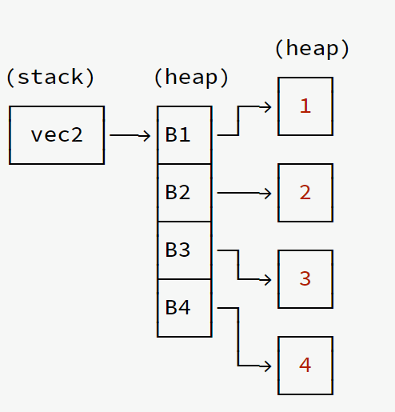

# Day eight

- 堆上底层数据并不会被拷贝，转移所有权仅仅是复制一份栈中的指针，再将新的指针赋予新的变量，然后让拥有旧指针的变量失效，最终完成了**所有权的转移**（很想知道，借用、所有权转移的失效和归还所有权怎么做到的
- 栈内存从高位地址向下增长，且栈内存是连续分配的，一般来说**操作系统对栈内存的大小都有限制**，因此 C 语言中无法创建任意长度的数组。
- 在 Rust 中，`main` 线程的栈大小是 `8MB`普通线程是 `2MB`，在函数调用时会在其中创建一个临时栈空间，调用结束后 Rust 会让这个栈空间里的对象自动进入 `Drop` 流程，最后栈顶指针自动移动到上一个调用栈顶，无需程序员手动干预，因而栈内存申请和释放是非常高效的。
- 与栈相反，堆上内存则是从低位地址向上增长，**堆内存通常只受物理内存限制**，而且通常是不连续的，因此从性能的角度看，栈往往比堆更高。
- 小型数据，在栈上的分配性能和读取性能都要比堆上高
- 中型数据，栈上分配性能高，但是读取性能和堆上并无区别，因为无法利用寄存器或 CPU 高速缓存，最终还是要经过一次内存寻址
- 大型数据，只建议在堆上分配和使用
- 栈的分配速度肯定比堆上快，但是读取速度往往取决于你的数据能不能放入寄存器或 CPU 高速缓存。

- 使用`Box<T>`将数据存储在堆上
  - `Box<T>`将动态大小类型DST，变为 Sized 固定大小类型；链表为递归类型，将`List` 存储到堆上，然后使用一个智能指针指向它，即可完成从 DST 到 Sized 类型(固定大小类型)的转变
  - 避免栈上数据的拷贝，大块的数据应该放入堆中

- `Vec<Box<i32>>` 的内存布局：

  

- 上面的 `B1` 代表被 `Box` 分配到堆上的值 `1`。

  可以看出智能指针 `vec2` 依然是存储在栈上，然后指针指向一个堆上的数组，该数组中每个元素都是一个 `Box` 智能指针，最终 `Box` 智能指针又指向了存储在堆上的实际值。

  因此当我们从数组中取出某个元素时，取到的是对应的智能指针 `Box`，需要对该智能指针进行解引用，才能取出最终的值：

  ```rust
  fn main() {
      let arr = vec![Box::new(1), Box::new(2)];
      let (first, second) = (&arr[0], &arr[1]);
      let sum = **first + **second;
  }
  ```

  - 使用 `&` 借用数组中的元素，否则会报所有权错误

  - 表达式不能隐式的解引用，因此必须使用 `**` 做两次解引用，第一次将 `&Box<i32>` 类型转成 `Box<i32>`，第二次将 `Box<i32>` 转成 `i32`

- `Box` 中还提供了一个非常有用的关联函数：`Box::leak`，它可以消费掉 `Box` 并且强制目标值从内存中泄漏
  - 如果 `String` 创建于函数中，那么返回它的唯一方法就是转移所有权给调用者 `fn move_str() -> String`，而通过 `Box::leak` 不仅返回了一个 `&str` 字符串切片，它还是 `'static` 生命周期的！
  - 标注的 `'static` 超出作用域，一样被释放回收。而使用 `Box::leak` 就可以将一个运行期的值转为 `'static`。
  - **需要一个在运行期初始化的值，但是可以全局有效，也就是和整个程序活得一样久**，那么就可以使用 `Box::leak`，例如有一个存储配置的结构体实例，它是在运行期动态插入内容，那么就可以将其转为全局有效，虽然 `Rc/Arc` 也可以实现此功能，但是 `Box::leak` 是性能最高的