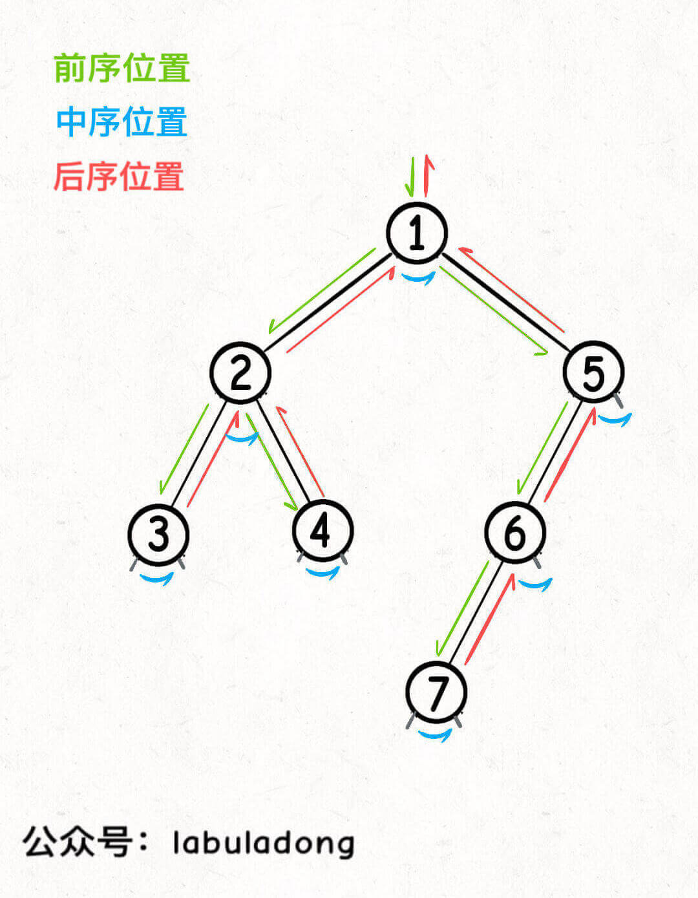
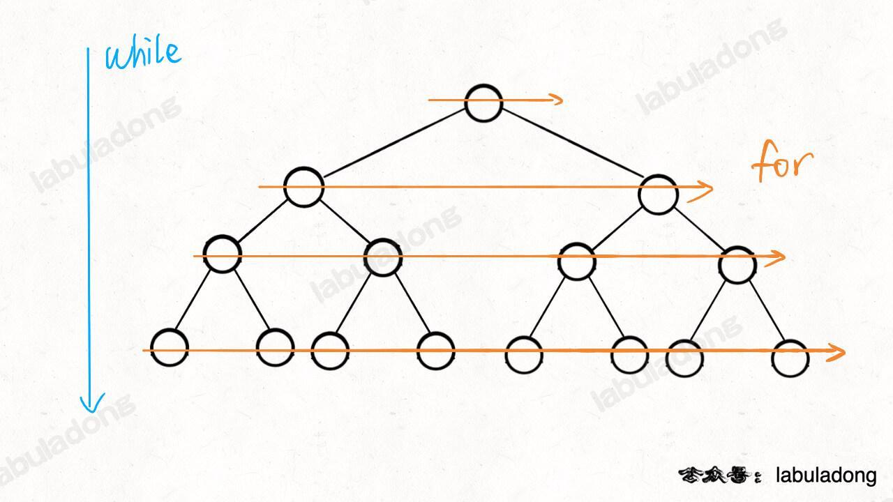

# Day one

### rust

- 赋值时类型不一致

  ```rust
  let v:u16 = 38_u8 as u16;
  ```

- ```rust
  let v2 = i8::checked_add(119, 8).unwrap();
  ```

  第一个数必须在i8范围内，checked_add可以显示处理溢出的panic

- Rust 的 HashMap 数据结构，是一个 KV 类型的 Hash Map 实现，它对于 K 没有特定类型的限制，但是要求能用作 K 的类型必须实现了 std::cmp::Eq 特征，因此这意味着你无法使用浮点数作为 HashMap 的 Key，来存储键值对，但是作为对比，Rust 的整数类型、字符串类型、布尔类型都实现了该特征，因此可以作为 HashMap 的 Key。

- ```rust
  assert!((0.1_f64 + 0.2 - 0.3).abs() < 0.000_1);
  ```

  这里必须加上`_f64`说明是浮点数，才有`abs()`方法

- ```rust
  assert_eq!((1..5), Range { start: 1, end: 5 });
  assert_eq!((1..=5), RangeInclusive::new(1, 5));
  ```

- 


### 其他	

#### algo

**二叉树**

- 快速排序：二叉树的前序遍历；归并排序：二叉树的后序遍历

  ```java
  //快速排序的代码框架如下
  void sort(int[] nums, int lo, int hi) {
      /****** 前序遍历位置 ******/
      // 通过交换元素构建分界点 p
      int p = partition(nums, lo, hi);
      /************************/
  
      sort(nums, lo, p - 1);
      sort(nums, p + 1, hi);
  }
  
  // 定义：排序 nums[lo..hi]
  void sort(int[] nums, int lo, int hi) {
      int mid = (lo + hi) / 2;
      // 排序 nums[lo..mid]
      sort(nums, lo, mid);
      // 排序 nums[mid+1..hi]
      sort(nums, mid + 1, hi);
  
      /****** 后序位置 ******/
      // 合并 nums[lo..mid] 和 nums[mid+1..hi]
      merge(nums, lo, mid, hi);
      /*********************/
  }
  ```

- 前序位置的代码执行是自顶向下的，而后序位置的代码执行是自底向上的 --> 语法制导翻译

  

  - 意味着前序位置的代码只能从函数参数中获取父节点传递来的数据，而后序位置的代码不仅可以获取参数数据，还可以获取到子树通过函数返回值传递回来的数据

  - 举具体的例子，现在给你一棵二叉树，两个简单的问题：

    1、如果把根节点看做第 1 层，如何打印出每一个节点所在的层数？（子层数 = 父层数+1，继承属性，使用L-属性定义，自顶向下分析，先序遍历）

    2、如何打印出每个节点的左右子树各有多少节点？（节点数=左子树节点数+右子树节点数，综合属性，使用S-属性定义，自底向上分析，后序遍历）

- 层次遍历

  - ````java
    // 输入一棵二叉树的根节点，层序遍历这棵二叉树
    void levelTraverse(TreeNode root) {
        if (root == null) return;
        Queue<TreeNode> q = new LinkedList<>();
        q.offer(root);
    
        // 从上到下遍历二叉树的每一层
        while (!q.isEmpty()) {
            int sz = q.size();
            // 从左到右遍历每一层的每个节点
            for (int i = 0; i < sz; i++) {
                TreeNode cur = q.poll();
                // 将下一层节点放入队列
                if (cur.left != null) {
                    q.offer(cur.left);
                }
                if (cur.right != null) {
                    q.offer(cur.right);
                }
            }
        }
    }
    
    ````

    

  - 

